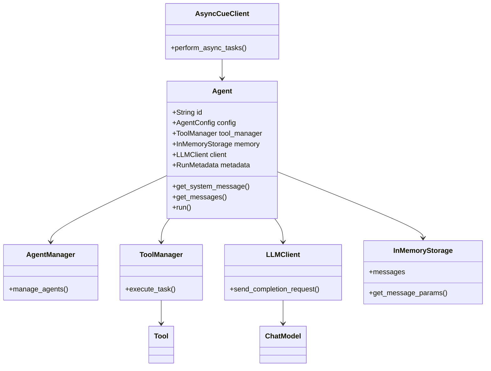

# Architecture Overview of Mini-Agent

## Project Structure
- **README.md**: Provides an introduction to the project, instructions for setting up the environment, running tests, and deploying the project.
- **src/cue/**: The core source directory containing modules and classes essential for the mini-agent system.

## Key Components
1. **Agent**:
   - Found in `_agent.py`.
   - Manages configurations and interactions for individual agents.
   - Utilizes LLMClient for communication.
   - Contains methods for generating system messages, handling messages, and running operations asynchronously.
   - Uses `ToolManager` for handling tasks and `InMemoryStorage` for message memory.

2. **AgentManager**:
   - Assists in managing multiple agents and coordinating their tasks.

3. **AsyncCueClient**:
   - Facilitates asynchronous operations within the mini-agent system.

4. **LLM**: 
   - Supports multiple chat models and clients, allowing agents to perform tasks using various LLM configurations.

5. **Schema**:
   - Provides structured data models using `pydantic` for requests, responses, and configurations.

6. **Tools**:
   - The `ToolManager` and related classes handle the execution of tasks that agents can perform.
   - Agents can leverage different tools based on their configuration.

## Setup and Execution
- **Environment**: Uses `.env` files for managing environment variables and API keys.
- **Dependencies**: Managed using Rye, a package management tool.
- **Scripts**: Includes `setup.sh` for environment setup and `run.sh` for launching the CLI client.

## Testing and Deployment
- **Testing**: Tests are located in the `tests` directory, with scripts to run unit, integration, and evaluation tests.
- **Deployment**: Uses Rye to build distributable packages and supports CI/CD workflows.

## Visualization with Mermaid
To visualize this architecture using Mermaid, the following diagram represents the overall structure and interactions:

This diagram shows the relationships between main classes and their responsibilities within the system. It provides a high-level view of how agents are configured, managed, and how they perform tasks using tools and LLMs.