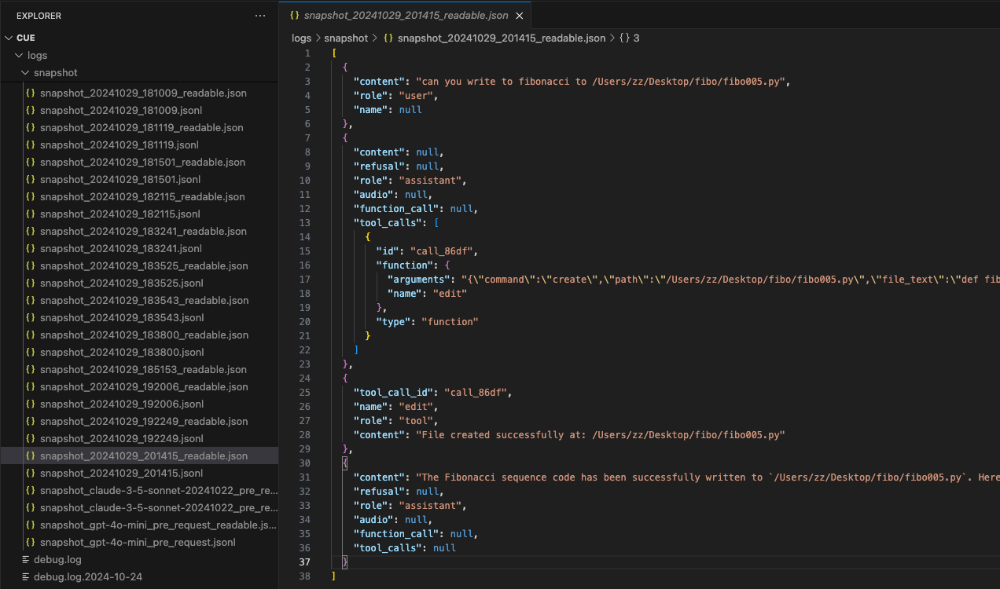
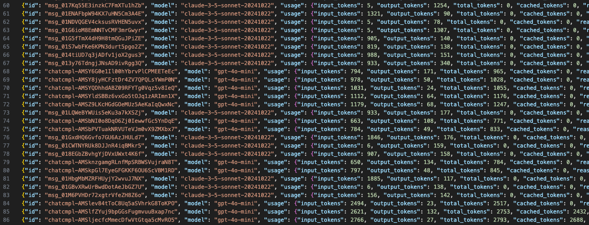

## Development

```bash
rye sync
```

Activate envronment

```bash
source .venv/bin/activate
```

```bash
cue -v
```

### Print debug level log

```bash
zz@~/cue$ export CUE_LOG=debug
```

### Run cue

```bash
cue -r
```

```bash
(cue) zz@~/cue$ cue -r
[2024-10-29 21:57:56.157][I] cue._agent_manager: AgentManager initialized
[2024-10-29 21:57:56.260][D] cue.llm.openai_client: [OpenAIClient] initialized with model: gpt-4o-mini main
[2024-10-29 21:57:56.261][I] cue._agent_manager: register_agent main (name: main), available agents: ['main']
[2024-10-29 21:57:56.261][D] cue._agent: Added tool <bound method Agent.chat_with_agent of <cue._agent.Agent object at 0x1082228b0>> to agent main
[2024-10-29 21:57:56.262][I] cue.cli._cli_async: Running the CLI. Commands: 'exit'/'quit' to exit, 'snapshot'/'-s' to save context
[User]: hello
```

### Run cue with step by step pause

It's very useful when you try to debug an event.

```bash
cue -r -d
```

```bash
(cue) zz@~/cue$ cue -r -d
[2024-10-29 21:58:24.552][I] cue._agent_manager: AgentManager initialized
[2024-10-29 21:58:24.658][D] cue.llm.openai_client: [OpenAIClient] initialized with model: gpt-4o-mini main
[2024-10-29 21:58:24.659][I] cue._agent_manager: register_agent main (name: main), available agents: ['main']
[2024-10-29 21:58:24.659][D] cue._agent: Added tool <bound method Agent.chat_with_agent of <cue._agent.Agent object at 0x10c8fa880>> to agent main
[2024-10-29 21:58:24.660][I] cue.cli._cli_async: Running the CLI. Commands: 'exit'/'quit' to exit, 'snapshot'/'-s' to save context
[User]: hello
[2024-10-29 21:58:27.214][D] cue.cli._cli_async: hello
[2024-10-29 21:58:27.216][D] cue._agent_manager: main other_agents_info: []
[2024-10-29 21:58:27.217][I] cue._agent_manager: Starting run with agent main
[2024-10-29 21:58:27.219][D] cue.context.context_manager: add_message metadata: {
    "original_size": 0,
    "final_size": 1,
    "total_tokens": 17
}
Maximum turn 6, current: 1. Debug. Continue? (y/n, press Enter to continue):
```

### Take a snapshot of current message list

The snapshot feature is to record the messages in current context window, it's very helpful for debuging for certain features.


You can trigger this by using:

```bash
-s
```

```
(cue) zz@~/cue$ cue -r -d
[2024-10-29 22:00:10.310][I] cue._agent_manager: AgentManager initialized
[2024-10-29 22:00:10.416][D] cue.llm.openai_client: [OpenAIClient] initialized with model: gpt-4o-mini main
[2024-10-29 22:00:10.416][I] cue._agent_manager: register_agent main (name: main), available agents: ['main']
[2024-10-29 22:00:10.417][D] cue._agent: Added tool <bound method Agent.chat_with_agent of <cue._agent.Agent object at 0x10b407820>> to agent main
[2024-10-29 22:00:10.417][I] cue.cli._cli_async: Running the CLI. Commands: 'exit'/'quit' to exit, 'snapshot'/'-s' to save context
[User]: -h

Available Commands:

exit
  Description: Exit the CLI
  Usage: exit or quit
  Examples:
    exit
    quit


snapshot, -s
  Description: Take a snapshot of current conversation context
  Usage: snapshot [message] or -s [message]
  Examples:
    snapshot
    -s
    snapshot let's continue our chat
    -s what's next?


help, -h
  Description: Show available commands
  Usage: help or -h [command]
  Examples:
    help
    -h
    help snapshot
    -h -s

[User]:
```

## Token Usage

Token usage will be recoreded automatically at `logs/usage.json`, you can check `src/cue/utils/usage_utils.py` for more details.

