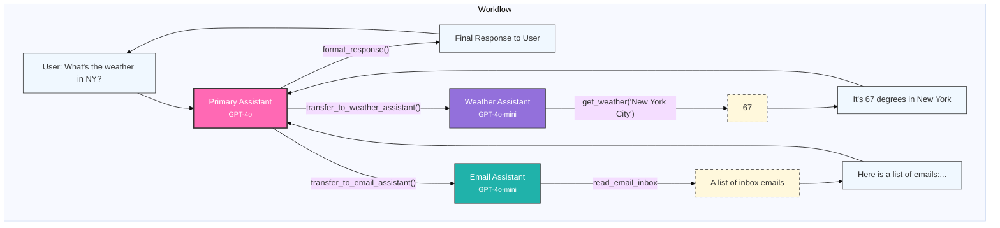

```mermaid
%%{init: {'theme': 'base', 'themeVariables': { 'fontSize': '16px'}}}%%

graph TD

    subgraph "Workflow"
        User["User: What's the weather in NY?"] --> Primary[Primary Assistant<br><small>GPT-4o</small>]
        Primary -->|"format_response()"| Final["Final Response to User"] --> User

        Primary -->|"transfer_to_weather_assistant()"| Weather[Weather Assistant<br><small>GPT-4o-mini</small>]
        Weather -->|"get_weather('New York City')"| Data[67]
        Data --> Response["It's 67 degrees in New York"]
        Response --> Primary

        Primary -->|"transfer_to_email_assistant()"| Email[Email Assistant<br><small>GPT-4o-mini</small>]
        Email -->|"read_email_inbox"| EmailData["A list of inbox emails"]
        EmailData --> EmailResponse["Here is a list of emails:..."]
        EmailResponse --> Primary
    end

    classDef primaryAssistant fill:#FF69B4,stroke:#333,stroke-width:2px,color:white
    classDef weatherAssistant fill:#9370DB,stroke:#333,color:white
    classDef emailAssistant fill:#20B2AA,stroke:#333,color:white
    classDef data fill:#FFF8DC,stroke:#333,stroke-dasharray: 5 5
    classDef userInput fill:#F0F8FF,stroke:#333

    class B,Primary primaryAssistant
    class C,Weather weatherAssistant
    class Email emailAssistant
    class D,Data,EmailData data
    class A,User,Final,E,Response,EmailResponse userInput
```
