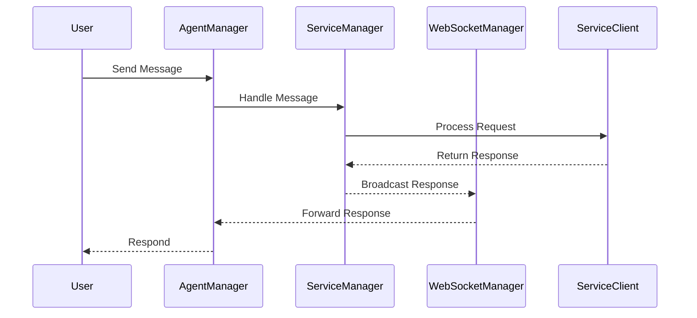
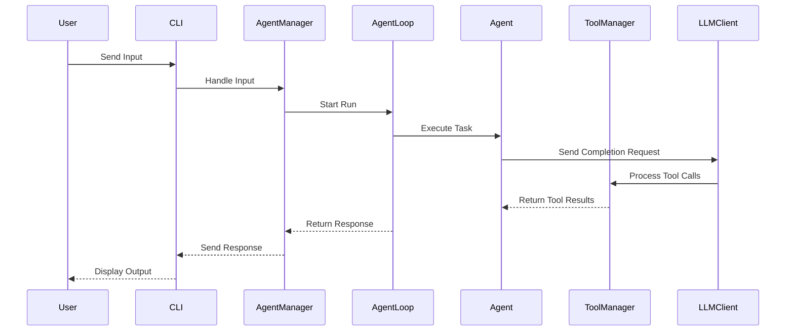

# Overview Document

## Introduction

This overview combines key content from `services.md` and reviews the following Python files:

- **\_agent_loop.py**
- **\_agent_manager.py**
- **\_agent.py**
- **\_agent_provider.py**
- **\_cli_async.py**

### Service Interaction Flow Diagram

## Key Components

### Agent Loop Run Flow Diagram

### Agent Loop

- **Purpose**: Manages execution of agents within the system.

### Agent Manager

- **Functionality**: Responsible for managing agent lifecycle and communication.

### Agent

- **Purpose**: Represents the individual agents that execute tasks and interact with components in the architecture.

### Tool Manager

- **Purpose**: Facilitates the use of tools by agents, managing their execution and results.

### LLM Client

- **Purpose**: Handles interactions with large language models, processing requests from agents and returning responses.

### CLI

- **Purpose**: Provides a command-line interface for user interactions with the system, sending inputs and displaying outputs.
