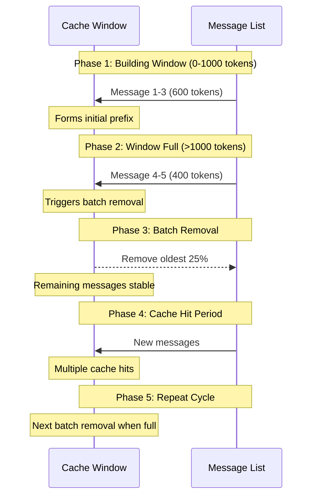

# Prompt Caching

Efficient context management for multi-turn AI interactions, optimizing both performance and cost.

## Overview

AI agents require sufficient context for effective reasoning across multiple turns. However, increasing context length impacts latency and costs. Prompt caching helps balance these trade-offs by reusing cached portions of prompts.

## How Caching Works

The system automatically caches prompts briefly and checks for cache hits on new requests. A cache hit occurs when the system matches content from **the beginning of the prompt**, making static prefix content crucial for effectiveness.

For implementation details, see:

- [OpenAI Prompt Caching](https://platform.openai.com/docs/guides/prompt-caching)
- [Anthropic Prompt Caching](https://docs.anthropic.com/en/docs/build-with-claude/prompt-caching)

OpenAI API automatically handles caching, for Anthropic, we need to manually add the `cache_control`, you can check `src/cue/llm/anthropic_client.py` for more implemtation details.

## Implementation

### Context Structure

Organized from most to least static:

1. System messages (model instructions)
2. Project context (goals and plans)
3. Memories (recent working context)
4. Message list (dynamic sliding window)

### Dynamic Context Management

You can check `src/cue/context/context_manager.py` for implementation details.

The message list uses a sliding window approach with two key strategies:

1. Batch Removal

- Removes messages in batches (25%) instead of individually
- Preserves cache effectiveness between removals

2. Cache Window

- Maintains stable message prefix after removals
- Enables multiple cache hits between batch removals

### Flow Diagram

## Future Improvements

- Adaptive batch sizing based on usage patterns
- Content-aware retention
- Dynamic window sizing
