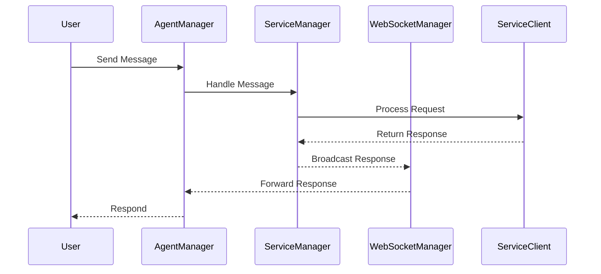

# Services Overview

This document outlines how the agents interact with various services in the system.

## Overview of Service Interaction

1. **AgentManager**:

   - Initializes the `ServiceManager` to manage service clients.
   - Establishes connections to various services and manages message events via the `ServiceManager`.
   - Broadcasts user and assistant responses via WebSocket through the `ServiceManager`.

2. **ServiceManager**:

   - Manages connections to various service clients (e.g., memory, message, assistant).
   - Establishes WebSocket connections and handles incoming/outgoing messages.
   - Provides methods to broadcast messages and handle WebSocket events (connect, disconnect).

3. **WebSocketManager**:
   - Oversees the lifecycle of WebSocket connections and processes messages accordingly.
   - Ensures stability with retry mechanisms for connection failures.
   - Handles specific message types from services, invoking appropriate handlers.

## Proposed Flow for Service Interaction

The following steps summarize how the agent interacts with services:

1. **Initialization**:

   - `AgentManager` initializes the `ServiceManager` and connects to services.
   - The `ServiceManager` initializes different service clients, such as MemoryClient and MessageClient.

2. **Message Handling**:

   - Upon receiving a message from the user, the `AgentManager` takes over the handling.
   - The `AgentManager` delegates handling to the `ServiceManager`, which processes the message through the appropriate service client.

3. **WebSocket Communication**:

   - The `ServiceManager` leverages the `WebSocketManager` for message broadcasting and handling incoming messages.
   - Incoming messages are processed through registered handlers in the `WebSocketManager`.

4. **Response Generation**:
   - Responses from services are sent back to the `AgentManager`, which then forwards them to the user.

## Sequence Diagram

